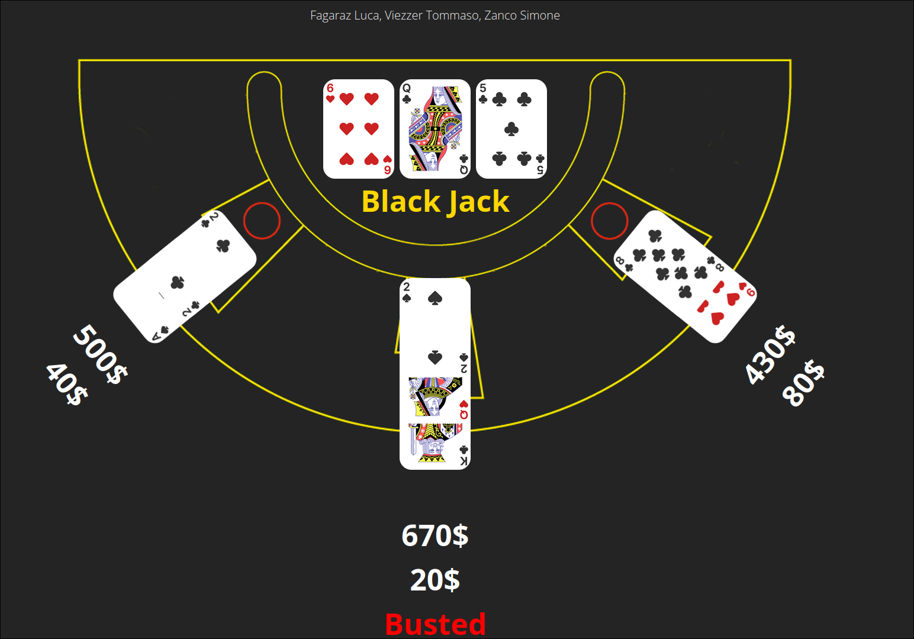
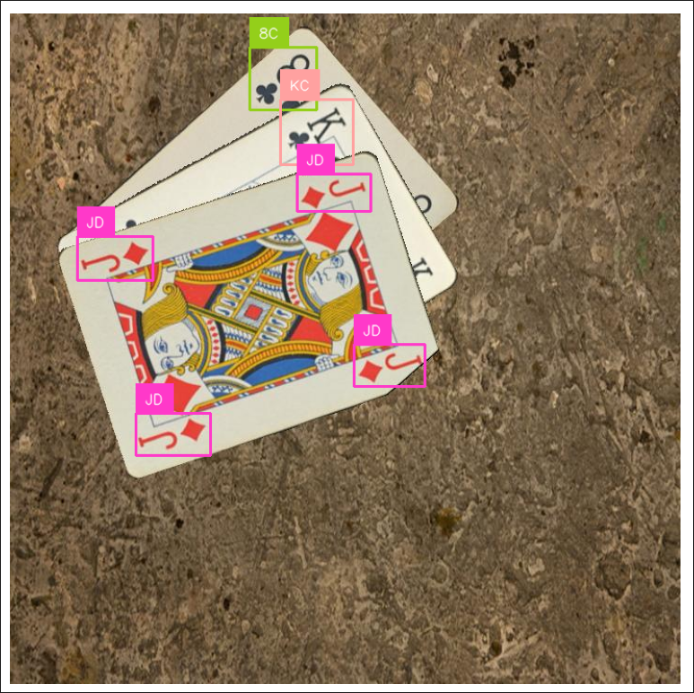

# Black-Jack
# IoT-Casino

A high school project concerning the realisation of a "smart" Black Jack table, that is able, using multiple ESP32 boards, to detect the cards dealt and show them on a web interface built with React. The web server is also capable of doing the computation on the values of the cards and the bets made by the players.

> [!NOTE]
> The python software runs in python 3.11 and uses the Roboflow API for the Neural Network

  
  

  

